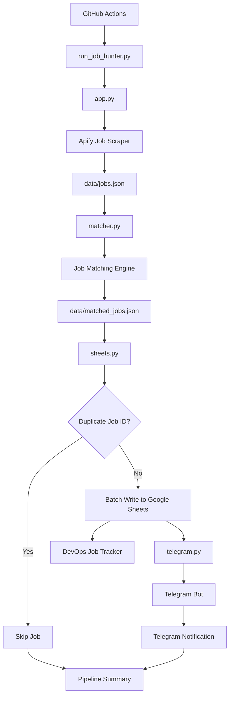

# 🚀 DevOps Job Hunter

An automated DevOps job discovery and notification system built with **Python, Apify, Google Sheets, Telegram, and GitHub Actions**.

The system automatically searches for relevant DevOps, Cloud, Platform, SRE, and Kubernetes roles, analyzes them against a predefined DevOps profile, removes duplicate jobs, stores matching opportunities in Google Sheets, and sends Telegram alerts for newly discovered jobs.

---

## 📌 Project Overview

Searching for jobs manually across multiple platforms can be repetitive and time-consuming.

This project automates the job discovery and tracking process while keeping the final application decision manual.

### What the system does

1. Searches for relevant jobs using Apify.
2. Retrieves job information through the Apify API.
3. Processes and analyzes job postings using Python.
4. Matches jobs against predefined DevOps skills and roles.
5. Calculates a match score.
6. Categorizes jobs based on relevance.
7. Detects duplicate jobs using the Job ID.
8. Stores new jobs in Google Sheets.
9. Sends Telegram notifications for newly discovered jobs.
10. Runs the complete pipeline through GitHub Actions.

---

# 🏗️ Architecture



---

# 🔄 End-to-End Flow

```text
GitHub Actions
      │
      ▼
run_job_hunter.py
      │
      ├───────────────┐
      ▼               │
    app.py            │
      │               │
      ▼               │
    Apify             │
      │               │
      ▼               │
data/jobs.json        │
      │               │
      ▼               │
  matcher.py          │
      │               │
      ▼               │
data/matched_jobs.json
      │
      ▼
   sheets.py
      │
      ▼
Duplicate Check
   │        │
   │        └── Duplicate → Skip
   │
   └── New Job
          │
          ▼
 Google Sheets
          │
          ▼
    Telegram Bot
          │
          ▼
 Telegram Alert
```

---

# 📂 Project Structure

```text
job-hunter/
│
├── app.py
├── matcher.py
├── sheets.py
├── telegram.py
├── run_job_hunter.py
├── requirements.txt
├── .env
├── .gitignore
├── google_credentials.json
│
├── data/
│   ├── jobs.json
│   └── matched_jobs.json
│
└── .github/
    └── workflows/
        └── job-search.yml
```

> **Security:** `.env` and `google_credentials.json` contain sensitive credentials and should never be committed to GitHub.

---

# 📄 File-by-File Explanation

## `app.py`

### Purpose

`app.py` is responsible for **job discovery**.

It communicates with the Apify Actor and retrieves job postings based on the configured search criteria.

### Current search focus

The search covers roles such as:

* DevOps Engineer
* Cloud DevOps Engineer
* AWS DevOps Engineer
* Azure DevOps Engineer
* Platform Engineer
* SRE
* Site Reliability Engineer
* Cloud Engineer
* Kubernetes Engineer
* DevOps + Terraform
* DevOps + Kubernetes
* Cloud Infrastructure Engineer

### Current location

```text
Hyderabad, Telangana, India
```

### Current limit

```text
25 jobs per source
```

### Output

The retrieved jobs are saved to:

```text
data/jobs.json
```

---

# 🧠 `matcher.py`

### Purpose

`matcher.py` is the **job matching engine**.

It reads the jobs collected by `app.py` and compares them against a predefined DevOps profile.

### Target roles

```text
DevOps Engineer
Cloud DevOps Engineer
Platform Engineer
Site Reliability Engineer
SRE
Cloud Engineer
Kubernetes Engineer
```

### Core skills

```text
Kubernetes
Docker
Terraform
CI/CD
Linux
```

### Supporting skills

```text
AWS
Azure
GitOps
Argo CD
HashiCorp Vault
Elasticsearch
Kibana
Prometheus
Grafana
```

### Matching factors

The matcher considers:

* Role relevance
* Core skills
* Supporting skills
* Location
* Remote availability
* Experience requirements
* Job freshness

### Match categories

```text
HIGH MATCH
GOOD MATCH
REVIEW
LOW MATCH
EXPERIENCE GAP
```

### Output

The processed results are stored in:

```text
data/matched_jobs.json
```

---

# 📊 `sheets.py`

### Purpose

`sheets.py` handles **Google Sheets integration**.

It reads the results generated by `matcher.py` and imports new jobs into the:

```text
DevOps Job Tracker
```

Google Sheet.

### Duplicate detection

Every job is identified using its:

```text
Job ID
```

If the Job ID already exists in Google Sheets:

```text
Duplicate → Skip
```

If the Job ID does not exist:

```text
New Job → Add to Google Sheets
```

### Batch processing

The system uses a **batch write** rather than writing every job individually.

Instead of:

```text
Job 1 → Google Sheets API
Job 2 → Google Sheets API
Job 3 → Google Sheets API
Job 4 → Google Sheets API
```

it performs:

```text
Job 1
Job 2
Job 3
Job 4
   │
   ▼
Batch Write
   │
   ▼
Google Sheets
```

This reduces Google Sheets API write requests and helps avoid rate-limit errors.

### Google Sheet columns

```text
Job ID
Date Found
Posted Date
Company
Job Title
Location
Match Score
Match Category
Experience
Core Skills Matched
Supporting Skills Matched
Missing Core Skills
Missing Supporting Skills
Remote
Job URL
Company URL
Applicants
Status
Notes
```

---

# 📱 `telegram.py`

### Purpose

`telegram.py` provides the Telegram notification functionality.

It contains a reusable function:

```python
send_telegram_message()
```

When a new job is successfully added to Google Sheets, the system sends a Telegram alert containing:

* Job title
* Company
* Location
* Match score
* Match category
* Matched core skills
* Matched supporting skills
* Missing skills
* Experience requirement
* Applicant count
* Job link
* Status

Example:

```text
🚨 NEW DEVOPS JOB

Senior Platform Engineer
Graphik Dimensions

📍 Hyderabad

🎯 Match: 73%
🔥 GOOD MATCH

Core Skills:
✓ Kubernetes, Docker, Terraform

Supporting Skills:
✓ AWS, GitOps

💼 Experience:
3-5 years

🔗 Apply:
Job URL

📝 Status: NEW
```

---

# 🔁 `run_job_hunter.py`

### Purpose

This is the **master orchestration script**.

Instead of manually running each Python file, it executes the complete pipeline in the correct order.

### Execution order

```text
1. app.py
2. matcher.py
3. sheets.py
```

### Flow

```text
run_job_hunter.py
       │
       ├── app.py
       │
       ├── matcher.py
       │
       └── sheets.py
```

If a script fails, the pipeline stops and reports which step failed.

---

# ⚙️ `.github/workflows/job-search.yml`

### Purpose

This file defines the **GitHub Actions CI/CD workflow**.

GitHub Actions provides the execution environment so the job-hunting pipeline does not need to run manually on a local computer.

### Workflow

```text
GitHub Actions
      │
      ▼
Checkout Repository
      │
      ▼
Setup Python
      │
      ▼
Install Dependencies
      │
      ▼
Create Google Credentials
      │
      ▼
run_job_hunter.py
```

The workflow currently supports:

```text
workflow_dispatch
```

which allows the pipeline to be manually triggered from GitHub Actions.

---

# 📦 `requirements.txt`

Contains the Python dependencies required by the project.

```text
requests
python-dotenv
gspread
google-auth
```

These libraries provide:

* HTTP/API communication
* Environment variable management
* Google Sheets integration
* Google authentication

---

# 🔐 Environment Variables

The following secrets are required:

```text
APIFY_API_TOKEN
TELEGRAM_BOT_TOKEN
TELEGRAM_CHAT_ID
GOOGLE_CREDENTIALS
```

### Local environment

These are stored in:

```text
.env
```

### GitHub Actions

The same credentials are stored securely as:

```text
GitHub Repository
        │
        ▼
Settings
        │
        ▼
Secrets and variables
        │
        ▼
Actions
```

Sensitive credentials should never be hard-coded into Python files or committed to the repository.

---

# 🗂️ Data Files

## `data/jobs.json`

Contains the raw job data retrieved from Apify.

```text
Apify
  ↓
jobs.json
```

This is the input for the matching engine.

---

## `data/matched_jobs.json`

Contains the jobs after Python matching and scoring.

```text
jobs.json
    ↓
matcher.py
    ↓
matched_jobs.json
```

The file contains information such as:

```text
Job ID
Title
Company
Location
Match Score
Match Category
Matched Skills
Missing Skills
Experience
Remote Status
Job URL
```

---

# 🎯 Matching System

The project uses a weighted scoring model.

| Category          |  Weight |
| ----------------- | ------: |
| Role Match        |      25 |
| Core Skills       |      35 |
| Supporting Skills |      20 |
| Location / Remote |      10 |
| Experience        |      10 |
| **Total**         | **100** |

The resulting score helps prioritize which jobs deserve review.

Example:

```text
88 → HIGH MATCH
75 → GOOD MATCH
70 → GOOD MATCH
67 → EXPERIENCE GAP
65 → GOOD MATCH
```

The score is an automated matching signal, not an automatic application decision.

---

# 🛡️ Duplicate Protection

Duplicate detection is based on the unique:

```text
Job ID
```

Example:

```text
First run:
Job ABC123 → NEW → Add

Second run:
Job ABC123 → DUPLICATE → Skip
```

This prevents the same job from repeatedly appearing in Google Sheets.

It also prevents repeated Telegram alerts for jobs that have already been imported.

---

# 📲 Notification Flow

```text
New Job Found
     │
     ▼
Matcher
     │
     ▼
Duplicate Check
     │
     ├── Duplicate
     │      └── No Alert
     │
     └── New Job
            │
            ▼
      Google Sheets
            │
            ▼
       Telegram Bot
            │
            ▼
       📱 Telegram
```

---

# ☁️ Technologies Used

| Technology             | Purpose                          |
| ---------------------- | -------------------------------- |
| Python                 | Automation and processing        |
| Apify                  | Job data collection              |
| LinkedIn job search    | Job discovery source             |
| Google Sheets          | Job tracking and storage         |
| Telegram Bot API       | Job notifications                |
| GitHub                 | Source control                   |
| GitHub Actions         | Automation / scheduled execution |
| JSON                   | Intermediate data storage        |
| gspread                | Google Sheets API integration    |
| Google Service Account | Google Sheets authentication     |

---

# 🚀 Running Locally

Clone the repository and install dependencies:

```bash
pip install -r requirements.txt
```

Configure the required environment variables in `.env`.

Then run:

```bash
python run_job_hunter.py
```

The pipeline will execute:

```text
Apify
  ↓
Job Collection
  ↓
Job Matching
  ↓
Duplicate Detection
  ↓
Google Sheets
  ↓
Telegram
```

---

# 🤖 Running Through GitHub Actions

The project can be executed from GitHub Actions.

Navigate to:

```text
GitHub
  ↓
Actions
  ↓
DevOps Job Hunter
  ↓
Run workflow
```

The workflow then runs the complete job-hunting pipeline.

---

# 🔮 Future Improvements

Potential future enhancements include:

* Automatic scheduled searches
* Multiple job locations
* Multiple job platforms
* Resume-to-JD similarity analysis
* AI-powered job ranking
* Recruiter discovery
* Recruiter contact tracking
* Application tracking
* Resume selection based on job description
* Email notifications
* Dashboard for job analytics
* Historical job-market analysis
* Job status automation
* Better keyword and semantic matching

---

# ⚠️ Important Design Principle

This project automates **job discovery, analysis, tracking, and notification**.

The final decision to apply remains manual.

```text
Automation
    ↓
Discover
    ↓
Analyze
    ↓
Match
    ↓
Notify
    ↓
Human Review
    ↓
Application
```

This keeps the automation focused on reducing repetitive work while allowing the user to review each opportunity before applying.

---

# 📈 Project Outcome

The project demonstrates practical implementation of:

* API integration
* Python automation
* CI/CD automation
* GitHub Actions
* Cloud-based workflow execution
* Secrets management
* Google API integration
* Telegram automation
* Data processing
* Duplicate detection
* Rule-based job matching
* Infrastructure/DevOps-oriented automation

It is designed as a practical **DevOps automation project** rather than a simple job scraper.

---

## 👨‍💻 Author

**Danish DS**

DevOps Engineer | Cloud | Kubernetes | Docker | Terraform | CI/CD | GitOps

---

⭐ If you find this project useful, feel free to explore the implementation and adapt the workflow for your own job-search automation.
